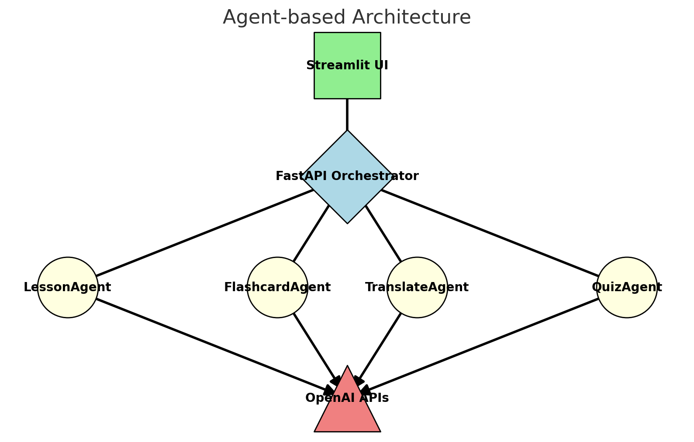
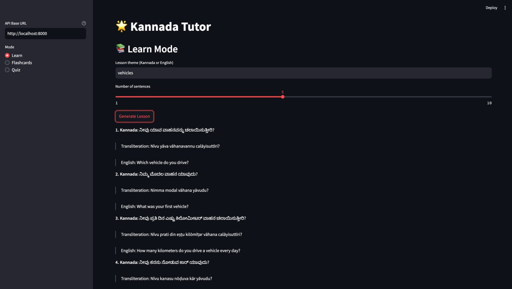
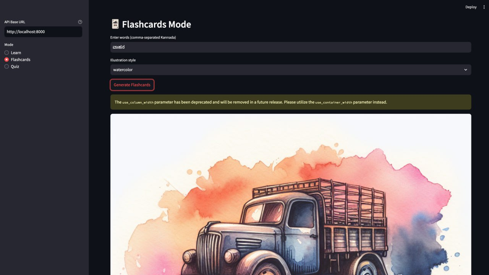
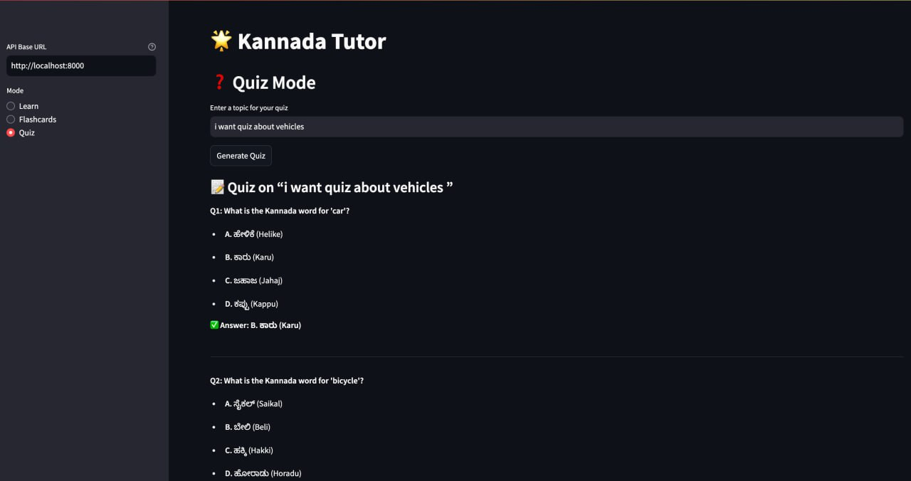

# Language-Kannada-Tutor
A multi-agent, interactive language learning application focused on Kannada. This project demonstrates how to integrate multiple AI agents and LLM capabilities into a cohesive tutoring platform, featuring:

- **Lesson Generation**: Generate interrogative Kannada sentences with transliteration and English translation.  
- **Flashcards**: Illustrate vocabulary via AI-generated images for visual learning.  
- **Translation**: Translate English text into Kannada with script and transliteration.  
- **Quiz**: Create multiple-choice quizzes on any topic to reinforce learning.

---

## 🏗 Architecture Diagram



The system consists of:
1. **Streamlit UI** (Green square)
2. **FastAPI Orchestrator** (Blue diamond)
3. **Agents** (Yellow circles)
   - LessonAgent, FlashcardAgent, TranslateAgent, QuizAgent
4. **OpenAI APIs** (Red triangle)

Data flows: UI → Orchestrator → Agents → OpenAI APIs → back through the chain.

---

## 🚀 Installation & Setup

1. **Clone the repository**
   ```bash
   git clone https://github.com/<your-username>/kannada-tutor.git
   cd kannada-tutor
   ```
2. **Create & activate a virtual environment**
   ```bash
   python3 -m venv venv
   source venv/bin/activate
   ```
3. **Install dependencies**
   ```bash
   pip install -r requirements.txt
   ```
4. **Set your OpenAI API key**
   ```bash
   export OPENAI_API_KEY="sk-your-real-key"
   ```
5. **Run the backend**
   ```bash
   uvicorn orchestrator:app --reload
   ```
6. **Launch the UI**
   ```bash
   streamlit run streamlit_app.py
   ```

---

## 🎯 Features & Screenshots

### 1. Lesson Generation

Generate themed interrogative Kannada sentences.

### 2. Flashcards

Visual flashcards for each generated word.

### 3. Translation

Translate English text into Kannada + transliteration.

### 4. Quiz

Multiple-choice quizzes on any topic.

---

## 🔬 Methodologies & Techniques Used

1. **Text Generation**: GPT-4 chat completions generate lesson content, translations, and quizzes.  
2. **Image Generation (Text-to-Image)**: DALL·E generates flashcard illustrations on-the-fly.  
3. **Few-Shot Sampling**: LessonAgent prompt includes an example to guide output formatting.  
4. **Zero-Shot Prompting**: TranslateAgent and QuizAgent operate without explicit examples in the prompt.  
5. **Persona Prompting**: System messages set the LLM’s role (``You are a helpful Kannada tutor…``).  
6. **Chain of Thought & Reasoning**: QuizAgent structures its prompt to encourage step-wise reasoning for question creation.  
7. **Agent Linking**: Decoupled Python classes (agents) orchestrated via FastAPI routes.  
8. **Large Language Models (LLMs)**: Core logic utilizes OpenAI’s GPT-4.  
9. **Retrieval-Augmented Generation (RAG)**: (Future) scope to integrate lesson content embeddings for context-aware quizzes.  
10. **Implementation of Agents**: Each agent is a standalone module, enabling easy testing and swapping.  
11. **MPC Server**: FastAPI + Uvicorn configured for production-ready ASGI serving.  
12. **Embeddings**: (Future) version could store lesson embeddings for retrieval.  
13. **Fine-Tuning**: (Future) could fine-tune models on Kannada-specific datasets.  
14. **Deployment & Scalability**: Streamlit + FastAPI can be containerized (Docker) and deployed to cloud platforms.  
15. **Ethical, Legal & Social Implications**: Includes placeholder docs to ensure bias review, data privacy, and user consent when using LLMs.

---

## 🛠 Roadmap & Extensions
- Integrate vector database for RAG-powered quizzes.  
- Add user authentication and progress tracking.  
- Support audio pronunciation via Text-to-Speech.  
- Deploy with Docker Compose and CI/CD pipelines.

---

## 📄 License

MIT © 2025 Kannada Tutor Team

